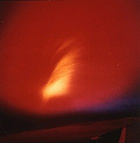
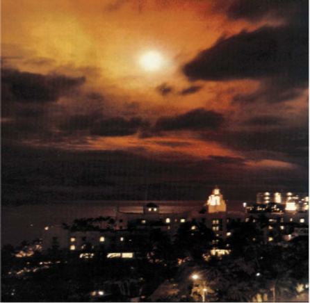
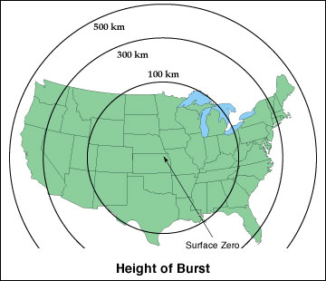

---?image=BG.jpg
## EMP Mitigation for Amateur Radio
### Trevor Best KG7VIP
#### Presentation Licensed CreativeCommons Attribution ShareAlike CC-BY-SA
---?image=BG.jpg
#### Available at tinyurl.com/kg7vip-emp
##### https://gitpitch.com/amundae/KG7VIP-EMP#/
##### Source available https://github.com/amundae/KG7VIP-EMP
---?image=BG.jpg
#### What is an EMP?
* An electromagnetic pulse (EMP), also sometimes called a transient electromagnetic disturbance, is a short burst of electromagnetic energy. Such a pulse's origination may be a natural occurrence or man-made and can occur as a radiated, electric, or magnetic field or a conducted electric current, depending on the source. -**Wikipedia**
---?image=BG.jpg
#### Natural EMP Sources
- Solar Events
- Lightning
- ESD
---?image=BG.jpg
#### Artificial EMP Sources
- Various Electrical Equipment (certain types of electric motors, ignition systems, etc)
- Powerline Surges
- Weaponized EMP (NEMP, HEMP, NNEMP)
---?image=BG.jpg
#### Primary Concerns
- Weaponized EMP
- Solar Events
---?image=BG.jpg
#### Starfish Prime
##### July 9, 1962
---?image=BG.jpg
### View from srveilance plane

---?image=BG.jpg
### View From Honolulu

---?image=BG.jpg
- 900 miles off the coast of Hawaii
- Altitude of 250 miles
- 10 degrees above Horizon in Honolulu
- Accurate to expected yield of 1.4 to 1.45 megatons (~15xHiroshima)
- EMP Yield was many times expectation
---?image=BG.jpg
- So large, that it could not be measured by much of the test equipment
- Knocked out 300 streetlight 898 miles away
- Disabled telephone service to Kauai
- Bright auroras visible from 21 degrees S to 23 Degrees north for 90 minutes
- Eventually disabled a third of all satellites in operation
---?image=BG.jpg
- Low yield weapon
- Not tuned for max EMP 
- Unintentional
---?image=BG.jpg

---?image=BG.jpg
### Mitigation Techniques
---?image=BG.jpg
### QST 1986 Series
---?image=BG.jpg
* Follow stringent lightning protection standards, with EMP capable suppressors
* Polyphaser & Alpha Delta in particular make protectors specifically for EMP protection
* General lightning protection units are likely not capable
* Keep in mind that Coax itself may be compromised
---?image=BG.jpg
* Older Equipment is better
* Keep it unplugged if not in use
---?image=BG.jpg
### Modern Equipment
---?image=BG.jpg
* In 1986, microprocessor manufacturing was 1 um, today, it is at 14 nm about to be 11
* Modern electronics are vulnerable to HEMP in an air-gapped state
* For absolute protection, they must be kept in a faraday cage
---?image=BG.jpg
* Uncompromised shield of solid metal
* Contents must be shielded from the metal
* A properly implemented DIY cage provides ~40 to 50 dB attenuation
* They can and should be layered
* Despite popular belief, a cage does not need to be grounded
---?image=BG.jpg
* Garbage cans
* Ammo cans
* Conductive Bags
* DIY conductive lined box
---?image=BG.jpg
* Always additionally shield the seam of any such solution
* Typically tape the the seam of the container with aluminum tape
* A taped garbage gains 300% attenuation over a nontaped one
---?image=BG.jpg
* Be very careful about bags, most on the internet are just mylar food storage bags and completely useless
* There are rampant myths regarding nearly every aspect of EMP preparedness, listen to the experts who aren't trying to sell you anything
* Keep your bravo sierra filters on high alert
---?image=BG.jpg
tinyurl.com/kg7vip-emp
